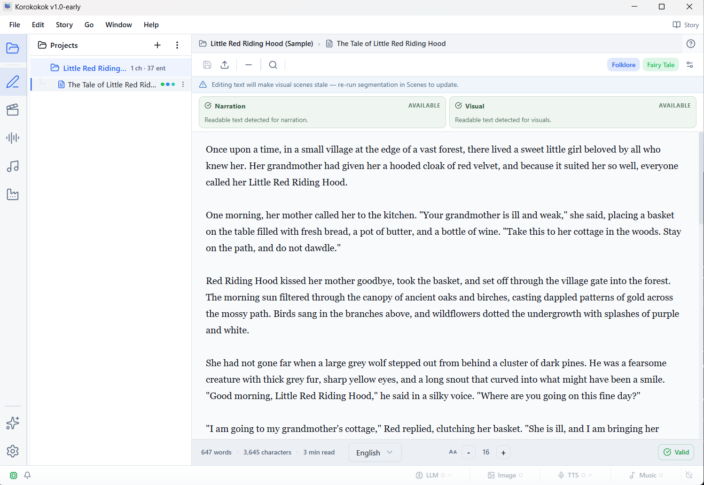
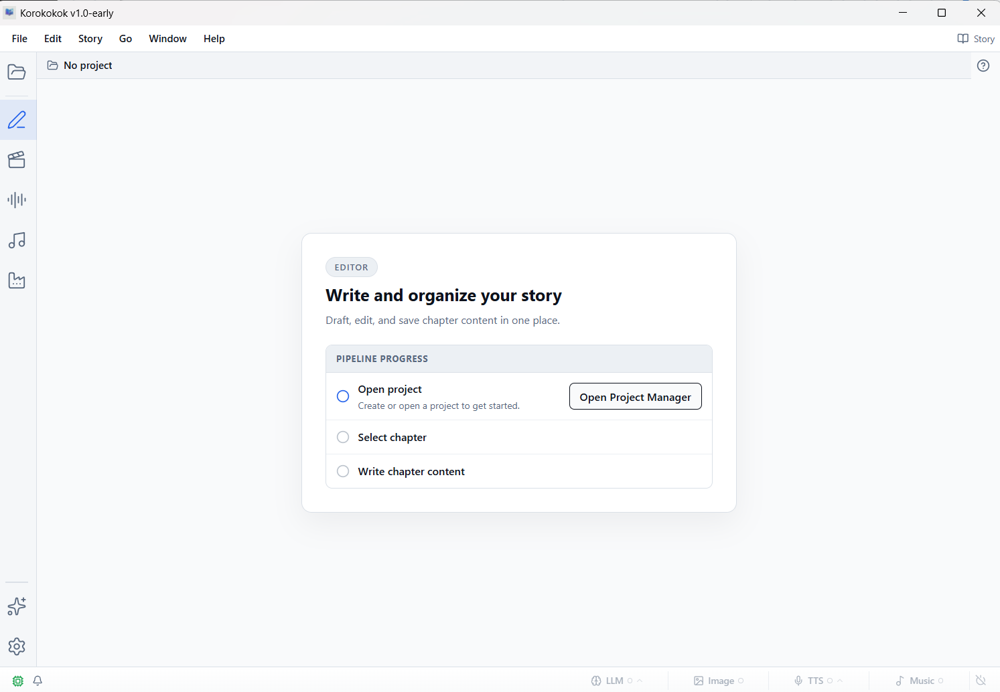

# Korokokok

**Story Production Studio for Windows** — *Early Preview (v0.9)*

Turn written stories into production-ready assets — AI-generated images, expressive narration with character voices, and original soundtracks. Fully offline, fully local.

> This is a **14-day free preview release**. Full commercial version with licensing launches soon. No account required, no payment wall during the preview.

## Download

Get the latest release from the [Releases page](https://github.com/jBlanca/Korokokok/releases). Each release includes an installer (`.exe`) and its SHA-256 hash in the release notes.

## Features

### Image Generation
- Generate illustrations from your story text with state-of-the-art local diffusion models
- Character and location reference images for visual consistency across scenes
- Background removal and interactive cutout tools

### Narration
- AI-powered narration with 60+ voices across 28 languages, plus expressive and multilingual engines
- Voice cloning for character dialog — clone a voice from a short sample
- Audio drama mode — narrator track with character voice overlays
- Full voice direction and performance control

### Music
- Generate original AI soundtracks for your story
- Style-guided composition with genre, mood, and instrumentation controls

### Story Tools
- Import and segment stories into chapters and beats
- AI-powered story analysis — characters, locations, visual prompts
- Project management with entity tracking

### Export
- Assembly Line workspace for packaging final assets
- Export narration, images, music, and video

## System Requirements

| | Minimum | Recommended |
|---|---|---|
| **OS** | Windows 10 (64-bit) | Windows 11 |
| **GPU VRAM** | 8 GB | 16 GB |
| **RAM** | 16 GB | 32 GB |
| **Disk** | 20 GB free | 50 GB free |
| **GPU** | NVIDIA (CUDA) | NVIDIA (CUDA) |

- **8 GB VRAM**: all core features work, including character-consistent image editing.
- **16 GB+ VRAM**: all features at full resolution and speed.
- AMD GPUs: TTS runs on CPU in this preview; GPU acceleration planned for a later release.
- The installer itself is ~52 MB. AI models and runtime components download on first use, only for the tools you install (~10–15 GB total depending on which features you use).

## Early Preview — what this release is

This is Korokokok v0.9, a **free 14-day preview** of the full product. It's the first public build, shared while the commercial release is still in review.

- ✅ All features are unlocked for 14 days
- ✅ No account, no credit card, no sign-up
- ⏸️ Auto-update is disabled in this preview (you'll need to download the next release manually when it's available)
- ⏸️ After day 14, Editor / Visual / Narration / Music lock. Project Manager, Assembly Line, and Tools Sandbox stay free forever.
- 🚀 **Korokokok v1.0** with one-time purchase licensing is coming soon

### If you'd like to support development

While the paid release is being finalized, if Korokokok saved you time during the preview you can [buy me a coffee on Ko-fi ☕](https://ko-fi.com/korokokokstudio). Completely optional — the preview is free either way.

### Get notified at v1.0 launch

Email [korokokok.storystudio@gmail.com](mailto:korokokok.storystudio@gmail.com?subject=Korokokok%20v1.0%20launch%20waitlist) with the subject *"Korokokok v1.0 launch waitlist"* and I'll send a one-time heads-up when v1.0 ships, along with early-supporter discount pricing.

## Support

- **General questions**: [korokokok.storystudio@gmail.com](mailto:korokokok.storystudio@gmail.com)
- **Bug reports & feature requests**: [Open an issue](https://github.com/jBlanca/Korokokok/issues/new/choose)
- **Common questions**: [FAQ](FAQ.md)

## Legal

- [Privacy Policy](PRIVACY.md)
- [Terms of Service](TERMS.md)
- [Refund Policy](REFUND.md)
- [License](LICENSE)
